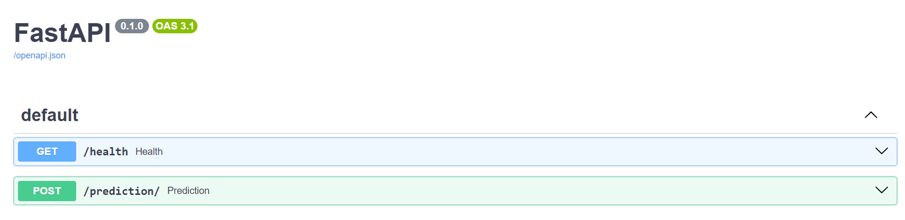

This project uses the well-known Titanic dataset to allow users to enter details of a hypothetical passenger and determines if he/she would have survived.  Having been containerized, it can run locally or you can push it to an EC2 instance and make it available globally. 



Stack: Built with FastAPI, scikit-learn, Docker, and deployed to AWS EC2 with MLflow for experiment tracking.

Model Performance:
Mean cross-val accuracy: 0.81372
Standard deviation: 0.02911

To run locally from your command line:  two steps
``` bash
docker pull alex737/titanic-api:latest
docker run -d -p 80:8000 alex737/titanic-api:latest
```
Then open http://localhost/docs to access the API.

To run from your EC2:
SSH into your EC2 instance. Make sure you have Docker installed.

Execute these two lones of  code inside your instance
```bash
docker pull alex737/titanic-api:latest 
docker run -d -p 80:8000 alex737/titanic-api:latest
```
Add inbound rule ---> HTTP, port 80, Anywhere-IPv4
Post your Public IPv4 address

